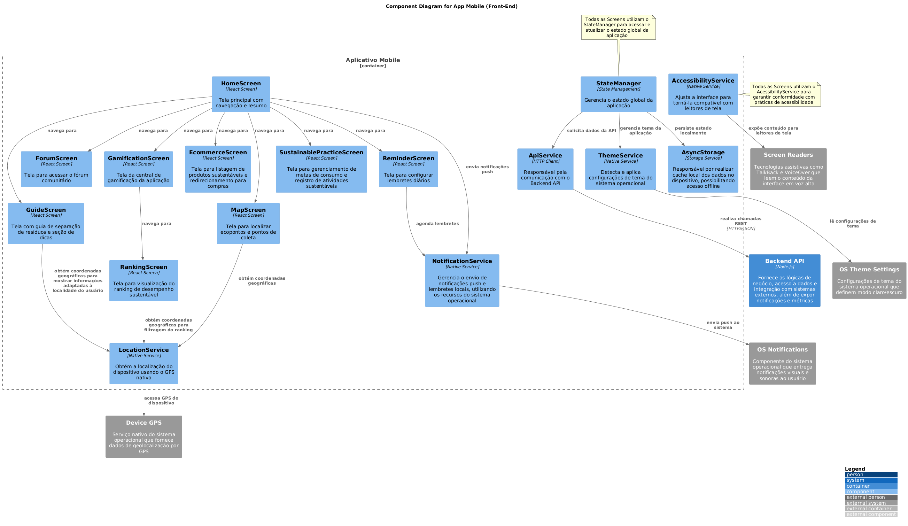
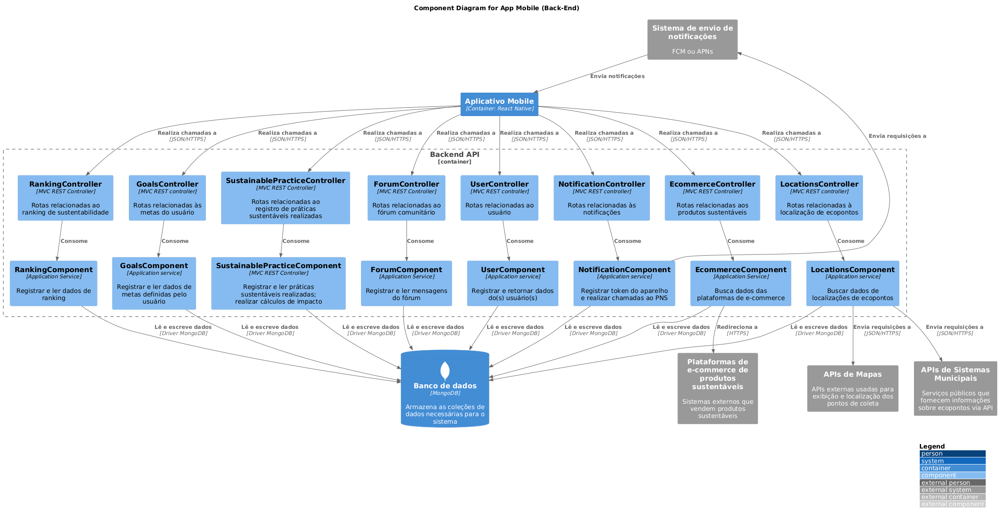
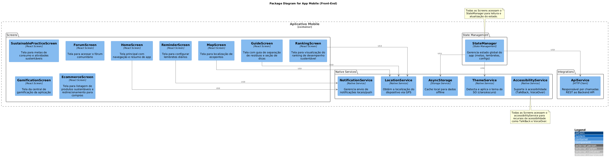
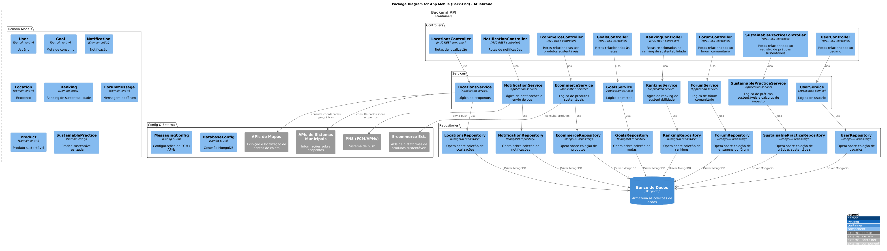

# Documento de Arquitetura de Software

## 1. Visão Geral do Sistema
- **Nome do sistema**: Aplicativo de Sustentabilidade Pessoal.
- **Objetivo**: Ajudar os usuários a adotarem práticas sustentáveis no dia a dia, incentivando hábitos conscientes e responsáveis com o meio ambiente.
- **Escopo**: O sistema consiste em um aplicativo mobile multiplataforma (Android e iOS) voltado à promoção de hábitos sustentáveis por meio de recursos interativos e personalizados. Entre suas principais funcionalidades, destacam-se: envio de notificações diárias com dicas práticas de sustentabilidade; definição e acompanhamento de metas de consumo consciente; configuração de lembretes para hábitos sustentáveis; localização de pontos de coleta com base na geolocalização do usuário; e acesso a um guia interativo adaptado às práticas locais de descarte de resíduos. O aplicativo também oferece um sistema de gamificação com recompensas e rankings, integração com e-commerce de produtos sustentáveis, registro de práticas e visualização dos impactos gerados, além de um fórum comunitário para troca de experiência entre os usuários.

## 2. Requisitos

### 2.1 Requisitos Funcionais

Com base nos objetivos e nas necessidades identificadas para o sistema, foram definidos os seguintes requisitos funcionais, os quais especificam de forma detalhada as funcionalidades que deverão ser implementadas para garantir o atendimento às expectativas dos usuários e o cumprimento do escopo proposto:

| ID | Requisito |
|----|------------|
| RF01 | O aplicativo deve aplicar técnicas de gamificação para incentivar o engajamento do usuário, oferecendo recompensas e estímulos sempre que atividades sustentáveis forem concluídas com sucesso. |
| RF02 | O aplicativo deve enviar notificações diárias aos usuários contendo dicas de práticas sustentáveis que possam ser aplicadas no cotidiano. |
| RF03 | O aplicativo deve permitir que o usuário localize ecopontos, pontos de coleta de eletrônicos e outros locais relacionados à sustentabilidade com base em sua localização geográfica. |
| RF04 | O aplicativo deve disponibilizar um guia interativo que auxilie o usuário na separação correta de diferentes tipos de resíduos (orgânicos, recicláveis, eletrônicos), adaptado às práticas de descarte da localidade do usuário. Além disso, deve oferecer uma seção, semelhante a um manual, com dicas, ideias de ações e sugestões de práticas sustentáveis que o usuário pode adotar no seu dia a dia. |
| RF05 | O aplicativo deve disponibilizar um fórum onde os usuários possam compartilhar suas práticas sustentáveis, trocar experiências e interagir com a comunidade. |
| RF06 | O aplicativo deve permitir a integração com plataformas de e-commerce que vendem produtos sustentáveis, facilitando o acesso dos usuários a esses itens diretamente pelo aplicativo. |
| RF07 | O aplicativo deve permitir que o usuário visualize sua posição em um ranking de desempenho sustentável, com a opção de filtrar os resultados por país, estado e cidade, incentivando a comparação saudável com outros usuários da mesma região. |
| RF08 | O aplicativo deve permitir que o usuário defina metas de consumo sustentável e acompanhe seu progresso ao longo do tempo. |
| RF09 | O aplicativo deve permitir que o usuário registre as práticas sustentáveis realizadas e visualize o impacto gerado, como a quantidade de CO2 economizado (em kg), entre outros indicadores de sustentabilidade. |
| RF10 | O aplicativo deve permitir que o usuário configure lembretes diários para hábitos sustentáveis que ele deseja adotar de forma rotineira. Esses lembretes serão exibidos como notificações no dispositivo do usuário. |

### 2.2 Requisitos de Qualidade

A partir dos requisitos funcionais previamente definidos, foram identificados os seguintes requisitos de qualidade, que especificam os atributos não funcionais essenciais para garantir a excelência do sistema:

| ID | Categoria | Requisito |
|----|-----------|-----------|
| RQ01 | Compatibilidade | O aplicativo deve ser compatível com dispositivos iOS e Android. |
| RQ02 | Segurança | O aplicativo deve implementar mecanismos de proteção de dados em conformidade com a LGPD, especialmente em relação a dados sensíveis como localização e hábitos pessoais. |
| RQ03 | Segurança | O aplicativo deve solicitar, de forma explícita, apenas as permissões estritamente necessárias para seu funcionamento, garantindo que o usuário compreenda claramente o motivo de cada solicitação antes de acessar dados sensíveis, como a localização. |
| RQ04 | Eficiência Energética | O consumo de bateria pelo aplicativo deve ser otimizado, especialmente ao utilizar recursos como GPS. |
| RQ05 | Confiabilidade | O aplicativo deve oferecer alternativas de localização quando o GPS não estiver disponível, como a busca por CEP ou endereço. |
| RQ06 | Confiabilidade | O aplicativo deve garantir que nenhuma informação do usuário seja perdida ou corrompida durante atualizações do aplicativo. |
| RQ07 | Confiabilidade | O aplicativo deve exibir uma mensagem clara quando ocorrer algum erro, como falha de conexão ou problema ao salvar uma meta. |
| RQ08 | Usabilidade | O aplicativo deve apresentar uma interface intuitiva que permita ao usuário configurar metas de consumo e lembretes em, no máximo, 3 cliques a partir da tela principal. |
| RQ09 | Usabilidade | As informações do guia interativo, da seção de práticas  sustentáveis e dos indicadores de impacto ambiental devem ser redigidas em linguagem acessível e clara, evitando termos técnicos, além de serem exibidas por meio de elementos visuais intuitivos. |
| RQ10 | Usabilidade | O aplicativo deve oferecer exemplos de metas de consumo sustentável, a fim de facilitar a configuração destas por novos usuários. |
| RQ11 | Usabilidade | Ao sair de uma tela de configuração sem salvar alterações, o aplicativo deve perguntar se o usuário deseja salvá-las ou descartá-las. |
| RQ12 | Usabilidade | O aplicativo deve se adaptar automaticamente ao tema escuro do sistema operacional, respeitando a preferência do usuário. |
| RQ13 | Manutenibilidade | O código-fonte do aplicativo deve seguir padrões de organização que facilitem a adição de novos tipos de ações sustentáveis sem a necessidade de modificar a estrutura principal. |
| RQ14 | Integrabilidade | O aplicativo deve ser capaz de consumir APIs disponibilizadas por sistemas municipais, a fim de obter informações relacionadas a pontos de coleta. |
| RQ15 | Integrabilidade | O aplicativo deve ser capaz de integrar-se com APIs de mapas, como Google Maps, para fornecer recursos de geolocalização e exibição de pontos de coleta no mapa. |
| RQ16 | Portabilidade | O aplicativo deve possuir um design responsivo, adaptando sua interface a diferentes tamanhos de tela. |
| RQ17 | Acessibilidade | O aplicativo deve ser compatível com leitores de tela como TalkBack (Android) e VoiceOver (iOS), permitindo que os elementos sejam lidos em voz alta. |
| RQ18 | Acessibilidade | Todas as imagens utilizadas no aplicativo devem ter descrições (alt-text) para que possam ser interpretadas por leitores de tela. |
| RQ19 | Manutenibilidade | A arquitetura do aplicativo deve ser intrinsecamente modular, com funcionalidades distintas encapsuladas em unidades independentes, de forma a facilitar sua manutenção e teste. |
| RQ20 | Manutenibilidade | A arquitetura do aplicativo deve ser projetada para facilitar a manutenção corretiva, adaptativa e evolutiva. |
| RQ21 | Testabilidade | A arquitetura do aplicativo deve ser inerentemente testável em todos os seus níveis (unitário, integração e ponta a ponta). |
| RQ22 | Escalabilidade | A hospedagem da aplicação em um ambiente de nuvem fornecerá a infraestrutura necessária para escalar os recursos de computação. |
| RQ23 | Integrabilidade | O aplicativo deverá integrar-se com um sistema de monitoramento para que este possa acompanhar continuamente a disponibilidade e o desempenho de todos os componentes da arquitetura. |
| RQ24 | Portabilidade | Funcionalidades básicas (como visualização de metas e leitura do guia interativo) devem estar acessíveis mesmo sem conexão à Internet, sincronizando os dados automaticamente quando o dispositivo voltar a ficar online. |
| RQ25 | Usabilidade | Novos usuários devem ser capazes de completar a configuração inicial do aplicativo em até 5 minutos, com tutoriais contextuais. |
| RQ26 | Segurança | O aplicativo deve implementar mecanismos de moderação automatizados no fórum para evitar a publicação de conteúdo inadequado, spam ou discurso de ódio. |
| RQ27 | Usabilidade | O fórum deve apresentar recursos como curtidas, respostas em tópicos e categorização por temas para facilitar a navegação e o engajamento dos usuários. |
| RQ28 | Integrabilidade | O aplicativo deve seguir padrões RESTful e utilizar autenticação segura para se integrar com plataformas de e-commerce de terceiros que oferecem produtos sustentáveis. |
| RQ29 | Confiabilidade | O sistema de ranking do aplicativo deve ser atualizado a cada 24 horas, garantindo a consistência e fidelidade das informações apresentadas. |
| RQ30 | Comunicabilidade | O aplicativo deve fornecer feedback visual e sonoro imediato sempre que uma atividade sustentável for concluída ou uma meta de consumo for atingida. |
| RQ31 | Usabilidade | O aplicativo deve possuir um sistema de pontuação, apresentado com descrições claras sobre como as atividades e metas geram pontos, incluindo critérios de pontuação e o que é necessário para atingir cada nível. |
| RQ32 | Usabilidade/Comunicabilidade | Ao concluir uma atividade sustentável ou cumprir uma meta de consumo, os pontos obtidos devem ser atualizados automaticamente no sistema de pontuação do aplicativo, refletindo o progresso do usuário no ranking. |
| RQ33 | Comunicabilidade | A exibição dos indicadores de impacto ambiental deve ocorrer de forma automática e consistente sempre que o usuário concluir uma atividade sustentável ou atingir uma meta, garantindo visibilidade imediata dos resultados gerados para o meio ambiente. |
| RQ34 | Usabilidade | O aplicativo deve exibir um indicador visual de progresso, como barras de nível, porcentagens ou medalhas, que permitam ao usuário acompanhar sua evolução ao longo das atividades sustentáveis realizadas e metas de consumo alcançadas. |
| RQ35 | Usabilidade | O aplicativo deve incluir um sistema de conquistas ou medalhas que reconheça automaticamente marcos importantes conquistados pelo usuário. |
| RQ36 | Usabilidade | O aplicativo deve fornecer desafios temáticos semanais, a fim de estimular a prática sustentável contínua dos usuários. |
| RQ37 | Usabilidade | O aplicativo deve utilizar recursos de sequência de dias ativos (streaks) e notificações motivacionais, a fim de incentivar o seu uso recorrente pelos usuários. |
| RQ38 | Acessibilidade | O aplicativo deve seguir as diretrizes definidas pelo WCAG (Web Content Accessibility Guidelines) para acessibilidade. |

## 3. Arquitetura

Com base nos requisitos de qualidade levantados, o estilo arquitetural escolhido para o desenvolvimento do aplicativo foi a **Arquitetura em Camadas**. Essa abordagem divide a aplicação em níveis bem definidos: apresentação, regras de negócios e persistência de dados, promovendo uma estrutura modular, de fácil manutenção e com forte separação de responsabilidades. Essa organização facilita a escalabilidade do sistema, a reutilização de componentes e o isolamento de mudanças entre camadas.

Dentro desse estilo, optou-se pelo padrão arquitetural **MVC (Model-View-Controller)**, por oferecer uma separação explícita entre os componentes de apresentação (View), controle (Controller) e dados (Model). Essa combinação permite uma fácil evolução do sistema, torna a interface mais adaptável a diferentes plataformas e se alinha diretamente às necessidades do aplicativo.

Para representar o modelo arquitetural adotado, optamos pelo uso do **Modelo C4**, devido à sua capacidade de apresentar a arquitetura do sistema em múltiplos níveis de abstração de uma maneira bem simples. Ademais, trata-se de um método predominantemente visual utilizado para descrever e documentar a arquitetura de softwares, o que possibilita uma comunicação clara e eficaz entre os diferentes stakeholders envolvidos no projeto.

O Modelo C4 estrutura a arquitetura do sistema em quatro níveis: Contexto, Container, Componente e Código. Cada um desses níveis será apresentado com mais detalhes nas subseções seguintes deste documento, por meio de diagramas.

### 3.1 Contexto

Traz a aplicação de uma perspectiva macro. Isto é, representa a solução na sua forma mais abstrata possível: o **sistema de software**. Além disso, mostra os **usuários** que utilizam esse sistema e **outros sistemas de software (externos) já existentes** com os quais ele interage. 

### 3.2 Container

Descreve com mais detalhes o sistema de software, mostrando os **containers** que o compõem e **como eles se comunicam** entre si. Ou seja, representa uma parte implantável do sistema. As decisões de tecnologia são uma parte fundamental desse diagrama. 

### 3.3 Componente

Amplia cada container individualmente, apresentando os diversos **componentes (partes)** dentro dele. Um componente é um **agrupamento de código com funcionalidades relacionadas**, encapsuladas atrás de uma interface muito bem definida.

### Container: Front-End

### Container: Back-End

### 3.4 Código

Expande um componente individual para mostrar **como ele é implementado**, refletindo diretamente o código. Tradicionalmente, esse nível é representado por diagramas de classes UML, que detalham atributos, métodos e relações entre classes. No entanto, optamos por utilizar **diagramas de pacotes** neste nível, pois eles permitem visualizar de forma mais clara a organização modular do código-fonte, destacando os principais diretórios e suas responsabilidades. Essa escolha também se justifica pelo fato de que muitas IDEs modernas já geram automaticamente diagramas de classes, tornando sua inclusão na documentação redundante para fins de entendimento estrutural.

### Pacotes: Front-End

### Pacotes: Back-End

